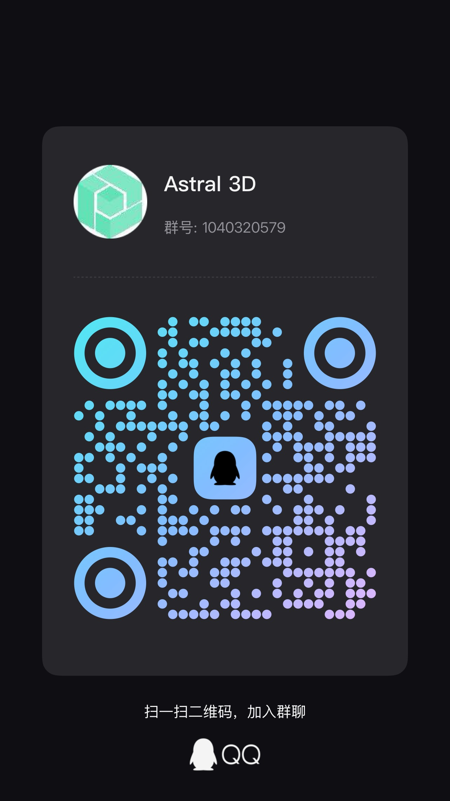

#  Astral 3D Editor

🌍 简体中文 | [English](README.en.md)

直达：    
[](https://github.com/mlt131220/Astral3D)
[](https://gitee.com/mlt131220/Astral3D)
[](https://editor.astraljs.com)

> 基于 Vue3 + Three.js 的现代 Web 3D 编辑器

<div align="center">
  
  
</div>

## 💬 加入社区

通过以下方式获取最新动态和技术支持：

|     | -07C160?logo=wechat&logoColor=white) 
|--------------------------------------------------------------------------------------------------|---------------------------------------------------------------------------------------------------|
|  |     | 


## 🚀 核心能力

### 核心功能
- ✅ 多格式支持：[30+ 模型格式（GLTF/OBJ/FBX/GLB/RVT/IFC等）](http://editor-doc.astraljs.com/guide/f7smai4w/#%E5%9F%BA%E7%A1%80%E6%93%8D%E4%BD%9C%E5%8C%BA)
- ✅ BIM模型轻量化展示（RVT/IFC）
- ✅ CAD图纸解析（DWG/DXF）
- ✅ 场景分包存储与加载
- ✅ 动画编辑器

### 扩展能力
- 🧩 插件系统
- 📜 脚本运行时
- 💫 粒子系统
- ❄️ 天气系统
- ☁️ 云存储集成
- 🎠 资源中心

### 即将到来
- 🚧 物理引擎支持
- 🚧 WebGPU 支持
- 🚧 数据组件（API/WebSocket）
- 🚧 低代码数据大屏
- 🚧 WebSocket 多人协作

## 🛠️ 技术栈


## ⚡ 快速开始

### 前置需求
- Node.js ≥ 23.11.x
- PNPM

### 本地运行
```bash
    git clone https://github.com/mlt131220/Astral3D.git

    cd Astral3D
    pnpm install
    pnpm run sdk:build
    pnpm run editor:dev
```

### 生产构建
```bash
    pnpm run editor:build
```

## 📚 生态相关

### 后端实现
[](https://github.com/yx8663/astral-service)

### 文档中心
[](http://editor-doc.astraljs.com/)

## ☕ 支持项目

如果本项目对您有帮助，欢迎：

1. 在 [用户案例墙](https://github.com/mlt131220/Astral3D/issues/2) 留下您的使用场景
2. 扫码支持开发者：

| 支付宝                                                                       | 微信                                                                           |
|---------------------------------------------------------------------------|------------------------------------------------------------------------------|
|  |  |

## ⚖️ 许可协议

本项目采用 [](LICENSE) 开源协议，使用时请遵守协议条款及以下补充条款：

- ✅ 允许：个人学习/二次开发    
- ⚠️ 需要版权声明    
- ⚠️ 商业用途需要授权    
- ❌ 禁止：将本项目用于与**杭州星孪数字科技**有竞争性的业务或非法用途    

**[完整法律声明](LEGAL.md)** | **[贡献指南](CONTRIBUTING.md)**

## 🌟 Star 趋势

[](https://star-history.com/#mlt131220/Astral3D&Date)